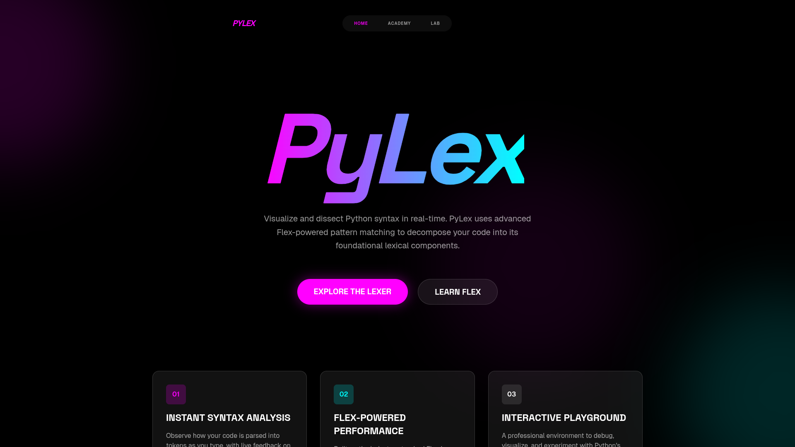
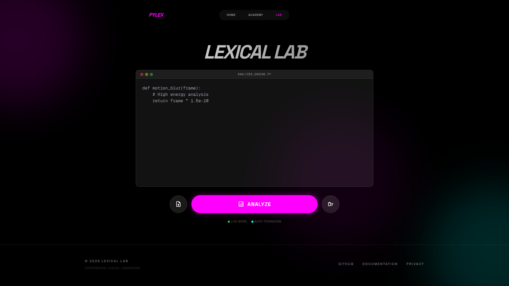
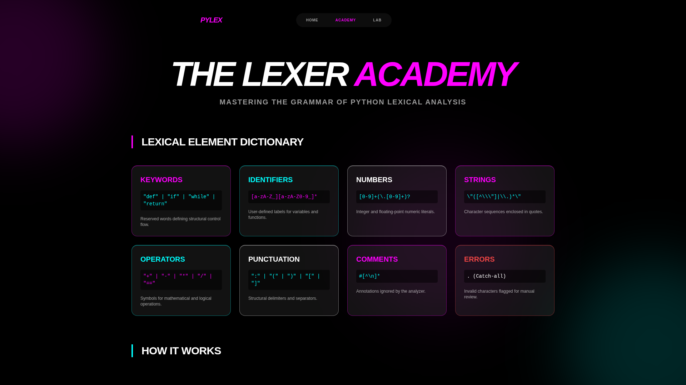
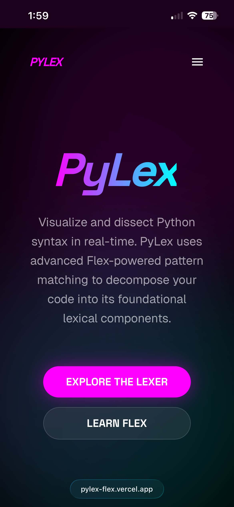
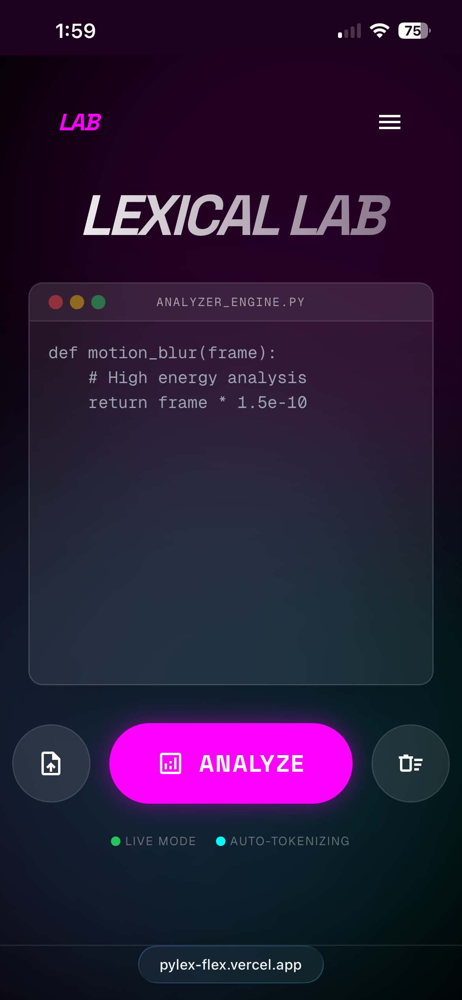

# PyLex: Python Lexical Analyzer

PyLex is a high-performance lexical analyzer for Python, powered by Flex and Flask. It provides a real-time, interactive environment to visualize and dissect Python syntax into its foundational tokens.


**🌐 Live Demo:** [https://pylex-flex.vercel.app](https://pylex-flex.vercel.app)  
**📺 Video Demo:** [Watch on YouTube](https://www.youtube.com/watch?v=your-video-id)

---

## Table of Contents
- [System Overview](#system-overview)
- [How It Works](#how-it-works)
- [Example Usage](#example-usage)
- [Supported Lexical Elements](#supported-lexical-elements)
- [Core Modules](#core-modules)
- [Technical Stack](#technical-stack)
- [Installation and Setup](#installation-and-setup)
- [Deployment Architectures](#deployment-architectures)
- [Quality Assurance](#quality-assurance)
- [Documentation](#documentation)

---

## System Overview

PyLex operates as an industrial-grade engine for tokenizing Python code. It translates a continuous stream of characters into structured lexical elements utilizing finite state automata generated by Flex. The architecture ensures sub-millisecond pattern matching and robust error handling.

<p align="center">
  
</p>

## How It Works

PyLex leverages a hybrid architecture combining high-level web technologies with low-level systems programming:

1.  **Input Acquisition**: The user enters Python source code into the **Lexical Lab**, a web-based code editor built with Tailwind CSS.
2.  **Backend Processing**: The Flask server receives the code via a RESTful API endpoint (`/tokenize`).
3.  **Lexical Analysis**: The backend pipes the raw text into a pre-compiled binary executable (`bin/lexer`). This binary is generated from a **Flex specification** (`src/lexer/lexer.l`), which defines Python's lexical grammar using Regular Expressions and Finite State Automata.
4.  **Token Stream**: The lexer identifies tokens (keywords, identifiers, etc.) and emits them as a stream of JSON objects, including metadata like line numbers and literal values.
5.  **Data Visualization**: The frontend parses the JSON stream and dynamically renders a color-coded decomposition of the code alongside a detailed analysis table, powered by **GSAP** for smooth animations.

## Example Usage

To analyze a Python function, follow these steps in the Lexical Lab:

1.  **Navigate** to the **Lab** section from the navigation bar.
2.  **Enter** the following Python snippet into the editor:
    ```python
    def calculate_sum(a, b):
        # Calculate the result
        return a + b
    ```
3.  **Analyze**: The engine will immediately produce a token breakdown:
    - `KEYWORD`: `def`, `return`
    - `IDENTIFIER`: `calculate_sum`, `a`, `b`
    - `OPERATOR`: `+`
    - `PUNCTUATION`: `(`, `)`, `:`, `,`
    - `INDENT`: (Detected indentation for the function body)
    - `DEDENT`: (Detected return to outer scope)

## Supported Lexical Elements

PyLex implements a comprehensive subset of the Python 3.13 lexical specification:

| Category | Description | Examples / Details |
| :--- | :--- | :--- |
| **Keywords** | Reserved words in Python 3.13 | `def`, `if`, `else`, `try`, `except`, `async`, `await`, `lambda`, etc. |
| **Identifiers** | Standard naming conventions | Letters/underscores followed by alphanumeric characters. |
| **Integers** | Whole number literals | Decimal, Hex (`0x`), Binary (`0b`), Octal (`0o`), Underscores (`1_000`). |
| **Floating Point** | Decimal point literals | Standard decimal and scientific notation (e.g., `3.14e-10`). |
| **Complex** | Imaginary number literals | Imaginary literals such as `5j`, `3.14J`, or `10.5j`. |
| **Strings** | Textual data literals | Single, double, and triple-quoted. Prefixes: `r` (raw), `b` (bytes), `f` (format). |
| **Booleans & None** | Literal constants | Dedicated recognition for `True`, `False`, and `None`. |
| **Comments** | Single-line explanations | Recognition of `#` style comments and inline annotations. |
| **Operators** | Functional symbols | Arithmetic (`+`, `**`, `//`), Assignment (`+=`), Comparison (`==`), Bitwise. |
| **Indentation** | Structural whitespace | `INDENT` and `DEDENT` tokens tracking block level structure. |
| **Punctuation** | Syntax delimiters | Delimiters like `(`, `)`, `[`, `]`, `{`, `}`, `:`, `,`, `.`, `;`, `->`, `...`. |
| **Error Handling** | Lexical validation | Detection of invalid characters and improper indentation levels. |

---

## Core Modules

### Lexical Lab
An interactive environment for real-time token decomposition. It provides immediate visual reconstruction and detailed tabular analysis of the inputted code, highlighting identifiers, keywords, literals, and operators.

<p align="center">
  
</p>

### The Lexer Academy
A technical reference dictionary detailing Python's lexical grammar. It provides the regular expression patterns used by the engine for various token classifications, serving as educational material for compiler design and finite automata.

<p align="center">
  
</p>

### Responsive Interface
The platform is fully optimized for mobile devices, ensuring a consistent and high-performance lexical analysis experience across all screen sizes.

<p align="center">
  &nbsp;&nbsp;&nbsp;&nbsp;
  
</p>

---

## Technical Stack

-   **Lexical Engine**: Flex (Lexer Generator) and GCC (C Compiler)
-   **Backend Architecture**: Python 3.13 and Flask Framework
-   **Frontend Presentation**: Tailwind CSS and GSAP (GreenSock Animation Platform)
-   **Deployment & CI/CD**: Docker, GitHub Actions, Vercel Serverless Functions

## Installation and Setup

### 1. System Prerequisites
Ensure Flex and GCC are installed on the host system to compile the lexer engine.
```bash
sudo apt-get install flex gcc # Ubuntu/Debian
```

### 2. Environment Configuration
Clone the repository and initialize the Python virtual environment.
```bash
git clone <your-repo-url>
cd flex_fproject

python3 -m venv venv
source venv/bin/activate
pip install -r requirements.txt
```

### 3. Compilation and Execution
Compile the Flex specification and start the Flask server.
```bash
# Compile the Flex specification
mkdir -p bin
flex -o bin/lex.yy.c src/lexer/lexer.l
gcc bin/lex.yy.c -o bin/lexer -lfl

# Start the application
python app.py
```
The application will be accessible at `http://127.0.0.1:5000`.

---

## Deployment Architectures

### Containerized Deployment (Docker)
The project includes a multi-stage Dockerfile optimized for production runtime environments, isolating the build process from the final slim image.
```bash
docker build -t pylex .
docker run -p 5000:5000 pylex
```

### Serverless Deployment (Vercel)
The repository is pre-configured for Vercel Serverless Functions. The pre-compiled binary is tracked to ensure immediate execution in cloud environments without build-time compilation dependencies.
```bash
vercel deploy
```

## Quality Assurance
Execute the integration test suite to verify lexer accuracy and system stability across various Python syntax edge cases.
```bash
python -m unittest discover tests
```

## Documentation
For a detailed history of updates, infrastructural changes, and architectural refinements, please refer to the [CHANGELOG.md](CHANGELOG.md).

---
Copyright 2026 Lexical Lab. Experimental Python Grammar Engine.
