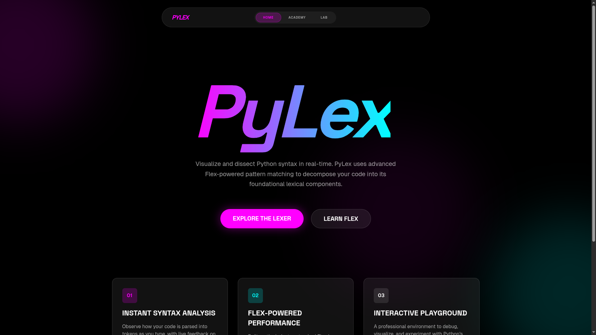
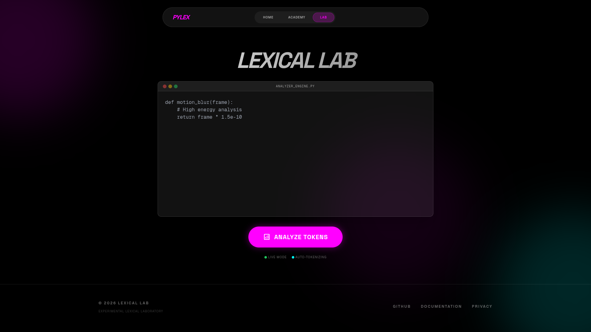
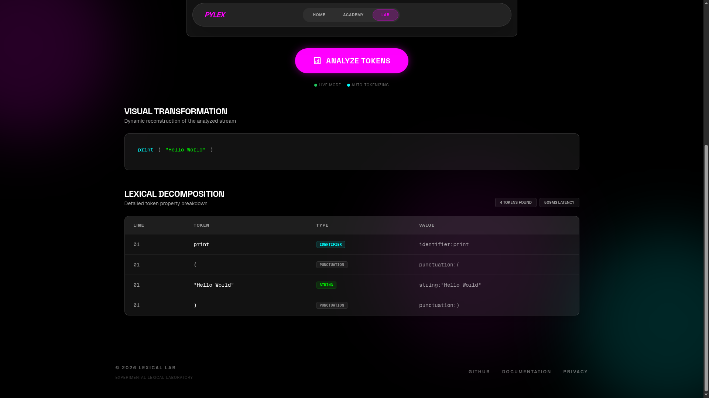
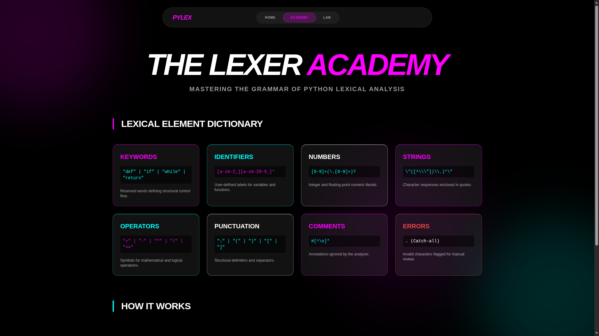

# PyLex: Precision Python Lexical Analysis

PyLex is a high-performance lexical analyzer for Python, powered by Flex and Flask. It provides a real-time, interactive environment to visualize and dissect Python syntax into its foundational tokens.


---

## System Overview

PyLex operates as an industrial-grade engine for tokenizing Python code. It translates a continuous stream of characters into structured lexical elements utilizing finite state automata generated by Flex. The architecture ensures sub-millisecond pattern matching and robust error handling.

<p align="center">
  
</p>

## Core Modules

### Lexical Lab
An interactive environment for real-time token decomposition. It provides immediate visual reconstruction and detailed tabular analysis of the inputted code, highlighting identifiers, keywords, high-precision literals, and operators.

<p align="center">
  
</p>

<p align="center">
  
</p>

### The Lexer Academy
A technical reference dictionary detailing Python's lexical grammar. It provides the regular expression patterns used by the engine for various token classifications, serving as educational material for compiler design and finite automata.

<p align="center">
  
</p>

---

## Technical Stack

- **Lexical Engine**: Flex (Lexer Generator) and GCC (C Compiler)
- **Backend Architecture**: Python 3.13 and Flask Framework
- **Frontend Presentation**: Tailwind CSS and GSAP (GreenSock Animation Platform)
- **Deployment & CI/CD**: Docker, GitHub Actions, Vercel Serverless Functions

## Installation and Setup

### 1. System Prerequisites
Ensure Flex and GCC are installed on the host system to compile the lexer engine.
```bash
sudo apt-get install flex gcc # Ubuntu/Debian
```

### 2. Environment Configuration
Clone the repository and initialize the Python virtual environment.
```bash
git clone <your-repo-url>
cd flex_fproject

python3 -m venv venv
source venv/bin/activate
pip install -r requirements.txt
```

### 3. Compilation and Execution
Compile the Flex specification and start the Flask server.
```bash
# Compile the Flex specification
mkdir -p bin
flex -o bin/lex.yy.c src/lexer/lexer.l
gcc bin/lex.yy.c -o bin/lexer -lfl

# Start the application
python app.py
```
The application will be accessible at `http://127.0.0.1:5000`.

---

## Deployment Architectures

### Containerized Deployment (Docker)
The project includes a multi-stage Dockerfile optimized for production runtime environments, isolating the build process from the final slim image.
```bash
docker build -t pylex .
docker run -p 5000:5000 pylex
```

### Serverless Deployment (Vercel)
The repository is pre-configured for Vercel Serverless Functions. The pre-compiled binary is tracked to ensure immediate execution in cloud environments without build-time compilation dependencies.
```bash
vercel deploy
```

## Quality Assurance
Execute the integration test suite to verify lexer accuracy, token precision, and system stability across various Python syntax edge cases.
```bash
python -m unittest discover tests
```

## Documentation
For a detailed history of updates, infrastructural changes, and architectural refinements, please refer to the [CHANGELOG.md](CHANGELOG.md).

---
Copyright 2026 Lexical Lab. Experimental Python Grammar Engine.
