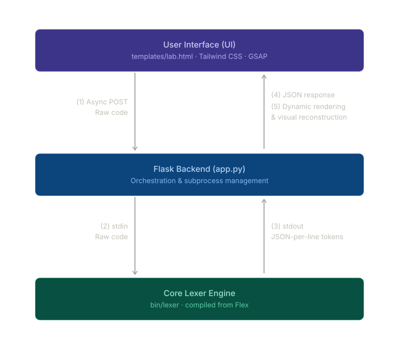

|  |  |  |
| :---: | :---: | :---: |

# PyLex — Python Lexical Analyzer
## Lexical Analysis Lab Documentation

**Student Name:** Mark Joseph Orias  
**Project:** PyLex — Flex & Flask Powered Python Tokenizer  
**Live Demo:** [pylex-flex.vercel.app](https://pylex-flex.vercel.app)  
**Repository:** [github.com/markjorias/PyLex](https://github.com/markjorias/PyLex)

---

## 1. Project Overview

This document details the implementation of PyLex, a high-performance lexical analyzer for Python, powered by Flex and Flask. The analyzer provides a real-time, interactive environment to visualize and dissect Python syntax into its foundational tokens.

PyLex operates as an industrial-grade engine for tokenizing Python code. It translates a continuous stream of characters into structured lexical elements utilizing finite state automata generated by Flex. The architecture ensures sub-millisecond pattern matching and robust error handling.

### Supported Language Scope

PyLex implements a comprehensive subset of the Python 3.13 lexical specification, supporting:

- Variable declarations and standard identifiers
- All Python keywords including `async`/`await` and `lambda`
- Integer literals in decimal, hex, binary, octal, and underscore-separated formats
- Floating point and complex (imaginary) number literals
- String literals with all prefix types (`r`, `b`, `f`) and triple-quoting
- Boolean and None constants
- Operators: arithmetic, assignment, comparison, and bitwise
- `INDENT` and `DEDENT` tokens for structural whitespace tracking
- Single-line comments via the `#` character
- All standard Python punctuation and delimiter characters

---

## 2. Token Specification

The following table outlines the lexical elements recognized by PyLex and their corresponding Regular Expressions implemented in the Flex specification (`src/lexer/lexer.l`).

| Category | Description | Examples | Regular Expression / Notes |
| :--- | :--- | :--- | :--- |
| **Keywords** | Reserved words in Python 3.13 | `def`, `if`, `else`, `try`, `async`, `await`, `lambda`, `return` | Direct string match on reserved word list |
| **Identifiers** | Standard naming conventions | `my_var`, `CamelCase`, `_private` | `[a-zA-Z_][a-zA-Z0-9_]*` |
| **Integers** | Whole number literals | `42`, `0xFF`, `0b101`, `0o77`, `1_000` | Decimal, Hex (`0x`), Binary (`0b`), Octal (`0o`), Underscores |
| **Floating Point** | Decimal point literals | `3.14`, `2.0e10`, `3.14e-10` | Standard decimal and scientific notation |
| **Complex** | Imaginary number literals | `5j`, `3.14J`, `10.5j` | Imaginary suffix `j` or `J` |
| **Strings** | Textual data literals | `'hello'`, `"world"`, `"""multiline"""` | Single, double, triple-quoted; `r`, `b`, `f` prefixes |
| **Booleans & None** | Literal constants | `True`, `False`, `None` | Dedicated token recognition |
| **Comments** | Single-line explanations | `# This is a comment` | `#` style inline comments |
| **Operators** | Functional symbols | `+`, `**`, `//`, `+=`, `==`, `&`, `\|` | Arithmetic, assignment, comparison, bitwise |
| **Indentation** | Structural whitespace | `INDENT`, `DEDENT` tokens | Block-level tracking of indentation changes |
| **Punctuation** | Syntax delimiters | `(`, `)`, `[`, `]`, `{`, `}`, `:`, `,`, `.`, `;`, `->`, `...` | All standard Python delimiter characters |
| **Error Handling** | Lexical validation | `[LEXICAL ERROR]` | Invalid characters, improper indentation levels |

---

## 3. Setup and Execution

### Prerequisites

To compile and run this project, ensure the following are installed:

- Flex (Fast Lexical Analyzer Generator)
- GCC (C Compiler)
- Python 3.13
- Flask Framework
- Node.js (optional, for frontend tooling)

### 1. System Prerequisites

Install Flex and GCC on Ubuntu/Debian:

```bash
sudo apt-get install flex gcc
```

### 2. Environment Configuration

Clone the repository and initialize the Python virtual environment:

```bash
git clone https://github.com/markjorias/PyLex.git
cd PyLex

python3 -m venv venv
source venv/bin/activate
pip install -r requirements.txt
```

### 3. Compilation and Execution

Compile the Flex specification and start the Flask server:

```bash
# Compile the Flex specification
mkdir -p bin
flex -o bin/lex.yy.c src/lexer/lexer.l
gcc bin/lex.yy.c -o bin/lexer -lfl

# Start the application
python app.py
```

The application will be accessible at `http://127.0.0.1:5000`.

---

## 4. Implementation Details

PyLex leverages a hybrid architecture combining high-level web technologies with low-level systems programming:

### How It Works

1. **Input Acquisition**: The user enters Python source code into the **Lexical Lab**, a web-based code editor built with Tailwind CSS.
2. **Backend Processing**: The Flask server receives the code via a RESTful API endpoint (`/tokenize`).
3. **Lexical Analysis**: The backend pipes the raw text into a pre-compiled binary executable (`bin/lexer`). This binary is generated from a **Flex specification** (`src/lexer/lexer.l`), which defines Python's lexical grammar using Regular Expressions and Finite State Automata.
4. **Token Stream**: The lexer identifies tokens (keywords, identifiers, etc.) and emits them as a stream of JSON objects, including metadata like line numbers and literal values.
5. **Data Visualization**: The frontend parses the JSON stream and dynamically renders a color-coded decomposition of the code alongside a detailed analysis table, powered by **GSAP** for smooth animations.

### System Architecture Diagram



### Understanding the System Flow

The diagram above shows how PyLex processes your code in five simple steps:

1.  **Sending Code**: When you click "Analyze," the **User Interface** sends your raw Python code to our backend server.
2.  **Handing Over**: The **Flask Backend** (the manager) receives the code and passes it directly to the "brain" of the system—the Core Lexer.
3.  **Breaking it Down**: The **Core Lexer Engine** (the specialist) quickly scans every character of your code, identifying it as a keyword, number, operator, or other element. It sends these results back as a stream of data.
4.  **Organizing Results**: The backend manager collects all those individual pieces into a single, organized list.
5.  **Visual Magic**: Finally, the website takes that organized list and instantly rebuilds your code on the screen with beautiful colors and smooth animations.

### Core Modules

#### Lexical Lab

An interactive environment for real-time token decomposition. It provides immediate visual reconstruction and detailed tabular analysis of the inputted code, highlighting identifiers, keywords, literals, and operators.

#### The Lexer Academy

A technical reference dictionary detailing Python's lexical grammar. It provides the regular expression patterns used by the engine for various token classifications, serving as educational material for compiler design and finite automata.

#### Responsive Interface

The platform is fully optimized for mobile devices, ensuring a consistent and high-performance lexical analysis experience across all screen sizes.

### Technical Stack

- **Lexical Engine**: Flex (Lexer Generator) and GCC (C Compiler)
- **Backend Architecture**: Python 3.13 and Flask Framework
- **Frontend Presentation**: Tailwind CSS and GSAP (GreenSock Animation Platform)
- **Deployment & CI/CD**: Docker, GitHub Actions, Vercel Serverless Functions

---

## 5. Error Handling

PyLex is designed to be "fault-tolerant." This means that if it encounters a character it doesn't recognize, it won't crash or stop working. Instead, it identifies the problem and moves on to the next part of your code.

### Example: Handling Unrecognized Characters

If you type: `price = 100 $`

1. The system recognizes `price`, `=`, and `100` as valid parts of Python.
2. It hits the `$`, which isn't a valid symbol in Python.
3. Instead of stopping, it marks the `$` as a **Lexical Error**.
4. It then continues looking for more tokens in the rest of the file.

### How it Works (Under the Hood)

- **Token Tagging**: The lexer emits a `[LEXICAL ERROR]` token with the offending character and line number.
- **Continuous Scanning**: Processing continues from the next valid character — the analyzer does not halt on a single error.
- **Indentation Safety**: Improper indentation levels (like inconsistent spacing) are detected and reported as specific indentation errors.
- **Visible Feedback**: All error tokens are sent to the frontend so they can be highlighted in the **Lexical Lab** interface.

---

## 6. Testing & Sample Output

Execute the integration test suite to verify lexer accuracy and system stability across various Python syntax edge cases:

```bash
python -m unittest discover tests
```

### Test Case 1: Valid Python Function

**Input:**

```python
def calculate_sum(a, b):
    # Calculate the result
    return a + b
```

**Expected Output:**

```
<KEYWORD, def>
<IDENTIFIER, calculate_sum>
<PUNCTUATION, (>
<IDENTIFIER, a>
<PUNCTUATION, ,>
<IDENTIFIER, b>
<PUNCTUATION, )>
<PUNCTUATION, :>
<COMMENT, # Calculate the result>
<INDENT>
<KEYWORD, return>
<IDENTIFIER, a>
<OPERATOR, +>
<IDENTIFIER, b>
<DEDENT>
```

### Test Case 2: Invalid Syntax

**Input:**

```python
int x = 10 $ 5;
```

**Expected Output:**

```
<IDENTIFIER, int>
<IDENTIFIER, x>
<OPERATOR, =>
<INTEGER, 10>
[LEXICAL ERROR]: Unrecognized token '$' on line 1.
<INTEGER, 5>
<PUNCTUATION, ;>
```

### Deployment Options

#### Docker (Containerized)

```bash
docker build -t pylex .
docker run -p 5000:5000 pylex
```

#### Vercel (Serverless)

```bash
vercel deploy
```

---

*Copyright 2026 Lexical Lab. Experimental Python Grammar Engine.*
